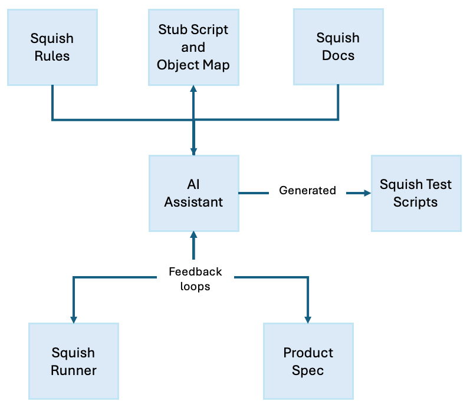

# Setup for Generating Squish Test Scripts with AI Assistants

A sample setup for generating [Squish](https://www.qt.io/quality-assurance/squish) ([documentation](https://doc.qt.io/squish/)) test scripts and test suites in Python with AI Assistants. See [the blog post](https://www.qt.io/blog/a-practical-guide-to-generating-squish-test-scripts-with-ai-assistants) for more or the video below:

Squish is a professional testing tool for automated GUI testing of desktop, embedded, and mobile applications.

## Setup used

* [Product Spec](AddressbookWPF/UI_REQUIREMENTS.md) - This document gives the AI assistant more context to understand the application's functionality, UI elements, and potential test scenarios
* [AI Assistant rules](.cursorrules) - Custom rules for an AI Assistant to follow when generating Squish test scripts. This file should be renamed and adapted for the used AI Assistant
* [Stub Script](suite_AI_testsuite/tst_stub/test.py) - Example test script used for seeding 
* [Object Map](suite_AI_testsuite/shared/scripts/names.py) - Created with Squish recording manually
* [Squish Test Script](suite_AI_testsuite/tst_add_and_delete_contacts/test.py) - Sample test script generated

See [the blog post](https://www.qt.io/blog/a-practical-guide-to-generating-squish-test-scripts-with-ai-assistants) for detailed explanations.

## License

See the [LICENSE](LICENSE) file for details.

## Contact

For questions and support:
- Open an issue in the repository
- Contact the author
